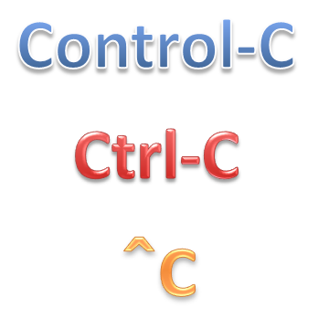

[control-c](https://www.npmjs.com/package/control-c) - npm
====

[English version](README.md#readme)

[ControlC](https://www.npmjs.com/package/control-c)は簡単なユーティティでSIGINTまたは
Control-Cをハンドリングする事ができます。<br/>
もちろん1回のControl-Cや2回とか3回以上のControl-Cもサポートします。

例えば、1回のControl-Cで、プログラムの状態をプリントしたり、<br/>
2回のControl-Cで、リセットや再初期化を行ったり、<br/>
3回のControl-Cで、クリーンアップと正常終了を行い、<br/>
4回以上は無視する、など。




# インストール:

[](https://nodei.co/npm/control-c/)
[](https://nodei.co/npm/control-c/)

```bash
$ npm install control-c
```


# 使い方:

```js
var ControlC = require('control-c');
```

## メソッド: new ControlC(handlers...)

  SIGINT (Control-C) をハンドリングする新しいハンドラーを新規に作成して追加する。

### 形式

```js
var c1 = new ControlC(
  function singleControlC() { console.log('single ctrl-c'); },
  function doubleControlC() { console.log('double ctrl-c'); },
  function tripleControlC() { console.log('triple ctrl-c'); this.remove(); },
  function ignoreControlC() {});

// or
var c2 = ControlC(
  function singleControlC() { console.log('single ctrl-c'); },
  function doubleControlC() { console.log('double ctrl-c'); },
  function tripleControlC() { console.log('triple ctrl-c'); this.remove(); },
  function ignoreControlC() {});

// or
var c3 = ControlC.create(
  function singleControlC() { console.log('single ctrl-c'); },
  function doubleControlC() { console.log('double ctrl-c'); },
  function tripleControlC() { console.log('triple ctrl-c'); this.remove(); },
  function ignoreControlC() {});
```

### パラメータ

  + **handlers**...: SIGINTハンドラー関数。必須

### 返り値

  ControlCクラスのインスタンス

## メソッド: this.remove() と this.add()

  SIGINTハンドラーの削除や追加を行う。

### 形式

```js
var c1 = new ControlC(function () {},
  function () { this.remove(); });
c1.remove();
c1.add();
```

## メソッド: ControlC.getInterval()

## メソッド: ControlC.setInterval(interval)

## プロパティ: ControlC.interval

  Control-Cタイムアウト間隔。ミリ秒。

### 形式

```js
ControlC.interval = 400;
console.log(ControlC.interval);
```

### パラメータ

  + **interval**: Control-Cタイムアウト間隔。200～2000ミリ秒。デフォルトは400ミリ秒。

# 例:

```js
'use strict';

var ControlC = require('control-c');

var singleCount = 0;
var doubleCount = 0;

new ControlC(
  function singleControlC() { console.log('Single:', ++singleCount); },
  function doubleControlC() { console.log('Double:', ++doubleCount); },
  function tripleControlC() { console.log('Reset'); singleCount = doubleCount = 0; },
  function quadrupleControlC() { console.log('Exit'); process.nextTick(process.exit); },
  function ignoreControlC() {});

console.log('press control-c in 30 seconds.');
setTimeout(function () {}, 30000);
```

# ライセンス:

  MIT
