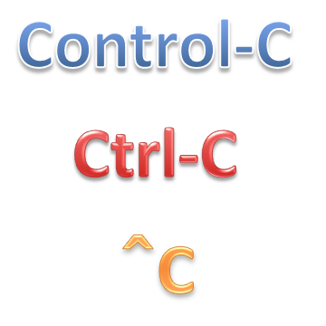

[control-c](https://www.npmjs.com/package/control-c) - npm
====

[ControlC](https://www.npmjs.com/package/control-c) is simple utility, handles SIGINT or Control-C.<br/>
Also suppot single control-c, double control-c, triple control-c and so on.

For example, print current status on single control-c,<br/>
reset or re-initialize on double control-c,<br/>
clean up and exit on triple control-c,<br/>
ignore quadruple or more control-c, and so on.

[Japanese version/■日本語版はこちら■](README-JP.md#readme)




# INSTALL:

[](https://nodei.co/npm/control-c/)
[](https://nodei.co/npm/control-c/)

```bash
$ npm install control-c
```


# USAGE:

```js
var ControlC = require('control-c');
```

## method: new ControlC(handlers...)

  Add new handlers to handle SIGINT (Control-C).

### Format

```js
var c1 = new ControlC(
  function singleControlC() { console.log('single ctrl-c'); },
  function doubleControlC() { console.log('double ctrl-c'); },
  function tripleControlC() { console.log('triple ctrl-c'); this.remove(); },
  function ignoreControlC() {});

// or
var c2 = ControlC(
  function singleControlC() { console.log('single ctrl-c'); },
  function doubleControlC() { console.log('double ctrl-c'); },
  function tripleControlC() { console.log('triple ctrl-c'); this.remove(); },
  function ignoreControlC() {});

// or
var c3 = ControlC.create(
  function singleControlC() { console.log('single ctrl-c'); },
  function doubleControlC() { console.log('double ctrl-c'); },
  function tripleControlC() { console.log('triple ctrl-c'); this.remove(); },
  function ignoreControlC() {});
```

### Parameters

  + **handlers**...: SIGINT handler functions, required

### Returns

  ControlC instance.

## method: this.remove() and this.add()

  Remove and add to hande SIGINT.

### Format

```js
var c1 = new ControlC(function () {},
  function () { this.remove(); });
c1.remove();
c1.add();
```

## method: ControlC.getInterval()

## method: ControlC.setInterval(interval)

## property: ControlC.interval

  Control-C timeout interval. milliseconds.

### Format

```js
ControlC.interval = 400;
console.log(ControlC.interval);
```

### Parameters

  + **interval**: Control-C timeout interval, between 200 and 2000 msec, default 400 msec

# EXAMPLE:

```js
'use strict';

var ControlC = require('control-c');

var singleCount = 0;
var doubleCount = 0;

new ControlC(
  function singleControlC() { console.log('Single:', ++singleCount); },
  function doubleControlC() { console.log('Double:', ++doubleCount); },
  function tripleControlC() { console.log('Reset'); singleCount = doubleCount = 0; },
  function quadrupleControlC() { console.log('Exit'); process.nextTick(process.exit); },
  function ignoreControlC() {});

console.log('press control-c in 30 seconds.');
setTimeout(function () {}, 30000);
```

# LICENSE:

  MIT
